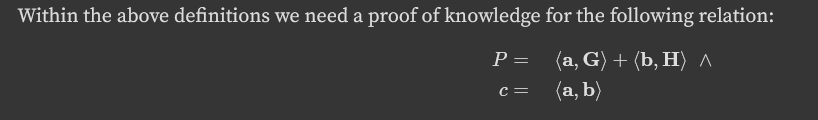

## обзор функциональности
```
Choose option:
- register
- login
- profile_description
- upload_file
- get_encrypted_file
- get_decrypted_file
- list_files
- logout
```
Имеем дело с самым обычным файлообменником, в котором мы можем создавать юзера, логиниться. Заливать файлики и читать их. 
## bulletproofs InnerProductProof: Point `P` disclosure 
Откроем документацию `InnerProductProof`, который используется для аутентификации пользователей: https://doc-internal.dalek.rs/bulletproofs/notes/inner_product_proof/index.html

Упрощенно, в ZKP(zero knowledge proof)  prover(доказывающий) пытается доказать verifier(проверяющему), что знает какую-то информацию, не раскрывая ее при этом. В данном случае он хочет доказать знание `P,c`, не раскрывая их.
Но команда `register` дает нам `P` вместе с `proof`:
```rust
"register" => {
			// ...
			let proof = InnerProductProof::create(&mut verifier,&Q,&G_factors,&H_factors,G.clone(),H.clone(),a.clone(),b.clone(),).to_bytes();
			
			let proof_bytes: Vec<u8> = P.compress().to_bytes().into_iter().chain(proof.into_iter()).collect();
			println!("here is your proof: {}", STANDARD.encode(proof_bytes));
			// ...
}
```
И этот же `proof` мы должны отправить в `login` для входа:
```rust
"login" => {
				// ...
				let mut proof_st = String::new();
                read_line!(proof_st);

                let bytes = STANDARD.decode(&proof_st).unwrap();
                let (P,proof) = match parse_proof(bytes){
                    Err(e) => {
                        println!("invalid proof format");
                        continue;
                    }
                    Ok(v) => v
                };
                //...
}

fn parse_proof(proof: Vec<u8>) -> Result<(RistrettoPoint, InnerProductProof), String>{
    let P = match CompressedRistretto::from_slice(&proof[..32]){
        Err(e) => return Err("parse error".to_string()),
        Ok(v) => match v.decompress(){
            None =>  return Err("parse error".to_string()),
            Some(v) => v
        }
    };
    let res_proof = match InnerProductProof::from_bytes(&proof[32..]){
        Err(e) => return Err("parse error".to_string()),
        Ok(v) => v
    };
    Ok((P, res_proof))
}
```
Получается, что `proof = b64encode(P[32 bytes] + InnerProductProof[32.. bytes])`, т.е. мы полностью контролируем `P` (первые 32 байта proof)
Структура оставшейся части `InnerProductProof`:
```rust
pub struct InnerProductProof {
    pub(crate) L_vec: Vec<CompressedRistretto>,
    pub(crate) R_vec: Vec<CompressedRistretto>,
    pub(crate) a: Scalar,
    pub(crate) b: Scalar,
}
```
Оставшиеся параметры верификации:
```rust
				let dimension = 4;
				let secret = Scalar::from_bytes_mod_order(include_bytes!("secret_key").clone()); // generated securely
			    
			    let bp_gens = BulletproofGens::new(dimension, 1);
			    let G: Vec<RistrettoPoint> = bp_gens.share(0).G(dimension).cloned().collect();
			    let H: Vec<RistrettoPoint> = bp_gens.share(0).H(dimension).cloned().collect();
			    let G_factors: Vec<Scalar> = iter::repeat(Scalar::ONE).take(dimension).collect();
                // ...
                let Q = RistrettoPoint::hash_from_bytes::<Sha512>(username.as_bytes());
                let key = Sha512::new().chain(&username).chain(secret.to_bytes());
                let mut verifier = Transcript::new(username.clone().leak().as_bytes());
                let y_inv = Scalar::from_hash(key);
                let H_factors: Vec<Scalar> = util::exp_iter(y_inv).take(dimension).collect();
				// ...
				match proof.verify(
                        dimension,
                        &mut verifier,
                        &G_factors,
                        &H_factors,
                        &P,
                        &Q,
                        &G,
                        &H
                )
```
Посмотрим на каждый из них отдельно:
```
dimension = 4 // размерность векторов для генерации и проверки proof
G_factors = [1,1,1,1]
H_factors = [1, y_inv, y_inv^2, y_inv^3] // создается от Sha512(username+secret) => его мы не знаем 
P - RistrettoPoint; берется из proof, мы контролируем
Q - RistrettoPoint; создается из Sha512(username), так что ее мы знаем
G,H - создаются при помощи BulletproofGens. Дебаггером можно обнаружить, что они всегда одни и те же. 
verifier - Transcript; можно рассматривать как хеш-функцию от передающихся в нее параметров (разберем дальше)
```
Посмотрим на сорцы `verify`:
```rust
    pub fn verify<IG, IH>(
        &self,
        n: usize,
        transcript: &mut Transcript,
        G_factors: IG,
        H_factors: IH,
        P: &RistrettoPoint,
        Q: &RistrettoPoint,
        G: &[RistrettoPoint],
        H: &[RistrettoPoint],
    ) -> Result<(), ProofError>
    where
        IG: IntoIterator,
        IG::Item: Borrow<Scalar>,
        IH: IntoIterator,
        IH::Item: Borrow<Scalar>,
    {
        let (u_sq, u_inv_sq, s) = self.verification_scalars(n, transcript)?;

        let g_times_a_times_s = G_factors
            .into_iter()
            .zip(s.iter())
            .map(|(g_i, s_i)| (self.a * s_i) * g_i.borrow())
            .take(G.len());

        // 1/s[i] is s[!i], and !i runs from n-1 to 0 as i runs from 0 to n-1
        let inv_s = s.iter().rev();

        let h_times_b_div_s = H_factors
            .into_iter()
            .zip(inv_s)
            .map(|(h_i, s_i_inv)| (self.b * s_i_inv) * h_i.borrow());

        let neg_u_sq = u_sq.iter().map(|ui| -ui);
        let neg_u_inv_sq = u_inv_sq.iter().map(|ui| -ui);

        let Ls = self
            .L_vec
            .iter()
            .map(|p| p.decompress().ok_or(ProofError::VerificationError))
            .collect::<Result<Vec<_>, _>>()?;

        let Rs = self
            .R_vec
            .iter()
            .map(|p| p.decompress().ok_or(ProofError::VerificationError))
            .collect::<Result<Vec<_>, _>>()?;

        let expect_P = RistrettoPoint::vartime_multiscalar_mul(
            iter::once(self.a * self.b)
                .chain(g_times_a_times_s)
                .chain(h_times_b_div_s)
                .chain(neg_u_sq)
                .chain(neg_u_inv_sq),
            iter::once(Q)
                .chain(G.iter())
                .chain(H.iter())
                .chain(Ls.iter())
                .chain(Rs.iter()),
        );

        if expect_P == *P {
            Ok(())
        } else {
            Err(ProofError::VerificationError)
        }
    }
```
Страшно, не правда ли? Но переписывается оно довольно просто:
```
except_P = a*b*Q+
+ a*s_0*G_0 + a*s_1*G_1 +... + // we control only a
+ b*s[n-1]*H_0 + b*s[n-2]*y_inv*H_1 + b*s[n-3]*y_inv^2 * H_2 + ... // we control only b
- (Ls[0]*u_sq[0] +Ls[1]*u_sq[1] + ...)
- (Rs[0]/u_sq[0] +Rs[1]/u_sq[1] + ...)
```
Читая код ниже выясняем, что `s` и `u_sq` зависят только от `Ls`, `Rs`, которые мы знаем. Тут и используется `Transcript` для их хеширования, создавая `s`, `u_sq`:
```rust
    pub(crate) fn verification_scalars(
        &self,
        n: usize,
        transcript: &mut Transcript,
    ) -> Result<(Vec<Scalar>, Vec<Scalar>, Vec<Scalar>), ProofError> {
        // ...

        // 1. Recompute x_k,...,x_1 based on the proof transcript
        let mut challenges = Vec::with_capacity(lg_n);
        for (L, R) in self.L_vec.iter().zip(self.R_vec.iter()) {
            transcript.validate_and_append_point(b"L", L)?;
            transcript.validate_and_append_point(b"R", R)?;
            challenges.push(transcript.challenge_scalar(b"u"));
        }
		// ...
        Ok((challenges_sq, challenges_inv_sq, s))
    }
```
Причем `L`,`R` не должны быть нулевыми точками на кривой (что проверяет `transcript.validate_and_append_point`)
```rust
    fn validate_and_append_point(
        &mut self,
        label: &'static [u8],
        point: &CompressedRistretto,
    ) -> Result<(), ProofError> {
        use curve25519_dalek::traits::IsIdentity;

        if point.is_identity() {
            Err(ProofError::VerificationError)
        } else {
            Ok(self.append_message(label, point.as_bytes()))
        }
    }
```
Получается, что для подделки пруфа нам не хватает только знания `y_inv`, но мы выяснили, что eзнать его невозможно.
Положим `b=0`, тогда от уравнения выше примет вид 
```
except_P =
+ a*s_0*G_0 + a*s_1*G_1 +... + // we control only a
- (Ls[0]*u_sq[0] +Ls[1]*u_sq[1] + ...)
- (Rs[0]/u_sq[0] +Rs[1]/u_sq[1] + ...)
```
В нем нам все известно. Давайте выберем случайные параметры `a` и `Ls`,`Rs`(на их основе сгенерируем `u_sq`,`s`), посчитаем except_P и его положим в `proof.P`.

Как это патчить? Можно сделать проверку на `b=0`, и для этого будет достаточно в данном случае.
Но вообще эта уязвимость схожа с Frozen Heart:

> Frozen heart TLDR: ни один из публичных параметров не является наиболее важным => все должны участвовать в хеше т.е. для параметров g,h,u,V, неправильно Hash(g,h,u), нужно Hash(g,h,u,V) - https://blog.trailofbits.com/2022/04/14/the-frozen-heart-vulnerability-in-giraults-proof-of-knowledge/.

Поэтому лучше бы добавить в `transcript` еще и `proof.a` с `proof.b`. Тогда проверку доказательства придется немного переписать(не знаю можно ли вообще).
## Эксплойт
```rust
use core::iter;
extern crate alloc;

use merlin::Transcript;
use base64::{engine::general_purpose::STANDARD, Engine as _};
use bulletproofs::{inner_product_proof::{inner_product, InnerProductProof}, util, BulletproofGens, ProofError};
use curve25519_dalek::{ristretto::CompressedRistretto, RistrettoPoint, scalar::Scalar, traits::VartimeMultiscalarMul,digest::Update};
use sha2::{Sha512,Digest};
use alloc::borrow::Borrow;
use bulletproofs::transcript::TranscriptProtocol;

#[derive(Clone, Debug)]
pub struct InnerProductProofForge {
    pub(crate) L_vec: Vec<CompressedRistretto>,
    pub(crate) R_vec: Vec<CompressedRistretto>,
    pub(crate) a: Scalar,
    pub(crate) b: Scalar,
}

fn verification_scalars(
    L_vec: &Vec<CompressedRistretto>,
    R_vec: &Vec<CompressedRistretto>,
    n: usize,
    transcript: &mut Transcript,
) -> Result<(Vec<Scalar>, Vec<Scalar>, Vec<Scalar>), ProofError> {
    let lg_n = L_vec.len();
    if lg_n >= 32 {
        // 4 billion multiplications should be enough for anyone
        // and this check prevents overflow in 1<<lg_n below.
        return Err(ProofError::VerificationError);
    }
    if n != (1 << lg_n) {
        return Err(ProofError::VerificationError);
    }

    transcript.innerproduct_domain_sep(n as u64);

    // 1. Recompute x_k,...,x_1 based on the proof transcript

    let mut challenges = Vec::with_capacity(lg_n);
    for (L, R) in L_vec.iter().zip(R_vec.iter()) {
        transcript.validate_and_append_point(b"L", L)?;
        transcript.validate_and_append_point(b"R", R)?;
        challenges.push(transcript.challenge_scalar(b"u"));
    }

    // 2. Compute 1/(u_k...u_1) and 1/u_k, ..., 1/u_1

    let mut challenges_inv = challenges.clone();
    let allinv = Scalar::batch_invert(&mut challenges_inv);

    // 3. Compute u_i^2 and (1/u_i)^2

    for i in 0..lg_n {
        // XXX missing square fn upstream
        challenges[i] = challenges[i] * challenges[i];
        challenges_inv[i] = challenges_inv[i] * challenges_inv[i];
    }
    let challenges_sq = challenges;
    let challenges_inv_sq = challenges_inv;

    // 4. Compute s values inductively.

    let mut s = Vec::with_capacity(n);
    s.push(allinv);
    for i in 1..n {
        let lg_i = (32 - 1 - (i as u32).leading_zeros()) as usize;
        let k = 1 << lg_i;
        // The challenges are stored in "creation order" as [u_k,...,u_1],
        // so u_{lg(i)+1} = is indexed by (lg_n-1) - lg_i
        let u_lg_i_sq = challenges_sq[(lg_n - 1) - lg_i];
        s.push(s[i - k] * u_lg_i_sq);
    }

    Ok((challenges_sq, challenges_inv_sq, s))
}

fn format_proof(P:&RistrettoPoint, proof: &InnerProductProofForge ) -> Vec<u8>{
    let mut buf = Vec::with_capacity((proof.L_vec.len() * 2 + 2) * 32);
    buf.extend_from_slice(&P.compress().to_bytes());
    for (l, r) in proof.L_vec.iter().zip(proof.R_vec.iter()) {
        buf.extend_from_slice(l.as_bytes());
        buf.extend_from_slice(r.as_bytes());
    }
    buf.extend_from_slice(proof.a.as_bytes());
    buf.extend_from_slice(proof.b.as_bytes());
    buf
}
pub fn forge_proof(username: &String)-> Result<String,ProofError>{
    // our_P =
    // + a*s_0*G_0 + a*s_1*G_1 +... + // we control only a
    // - (Ls[0]*u_sq[0] +Ls[1]*u_sq[1] + ...)
    // - (Rs[0]/u_sq[0] +Rs[1]/u_sq[1] + ...)

    let dimension = 4;
    let mut transcript = Transcript::new(username.clone().leak().as_bytes());
    let bp_gens = BulletproofGens::new(dimension, 1);
    let G: Vec<RistrettoPoint> = bp_gens.share(0).G(dimension).cloned().collect();
    let mut rng = rand::thread_rng();
    let lg2_n = 2; //log2(dimension)
    let G_factors: Vec<Scalar> = iter::repeat(Scalar::ONE).take(dimension).collect();

    let L_vec: Vec<CompressedRistretto> = (0..lg2_n).map(|_| RistrettoPoint::random(&mut rng).compress()).collect();
    let R_vec: Vec<CompressedRistretto> = (0..lg2_n).map(|_| RistrettoPoint::random(&mut rng).compress()).collect();
    

    let Ls = L_vec.iter().map(|p| p.decompress().ok_or(ProofError::VerificationError)).collect::<Result<Vec<_>, _>>()?;
    let Rs = R_vec.iter().map(|p| p.decompress().ok_or(ProofError::VerificationError)).collect::<Result<Vec<_>, _>>()?;

    let (u_sq, u_inv_sq, s) = verification_scalars(&L_vec, &R_vec, dimension, &mut transcript)?;
    let a = Scalar::random(&mut rng);
    let b = Scalar::from(0u32);
    let g_times_a_times_s = G_factors.into_iter().zip(s.iter()).map(|(g_i, s_i)| (a * s_i) * g_i.borrow()).take(G.len());
    let neg_u_sq = u_sq.iter().map(|ui| -ui);
    let neg_u_inv_sq = u_inv_sq.iter().map(|ui| -ui);

    let expect_P = RistrettoPoint::vartime_multiscalar_mul(
        neg_u_inv_sq.chain(neg_u_sq).chain(g_times_a_times_s),
            Rs.iter().chain(Ls.iter()).chain(G.iter())
    );
    let result = format_proof(&expect_P, &InnerProductProofForge{a:a,b:b,L_vec:L_vec,R_vec:R_vec});
    Ok(STANDARD.encode(result))

}

use std::env;

fn main(){
    // username = argv[1]
    let username = &env::args().collect::<Vec<String>>()[1];

    let forged_proof = forge_proof(username);
    match forged_proof{
        Ok(v) => println!("{}", v),
        Err(e) => println!("ERROR")
    }
    
}
```